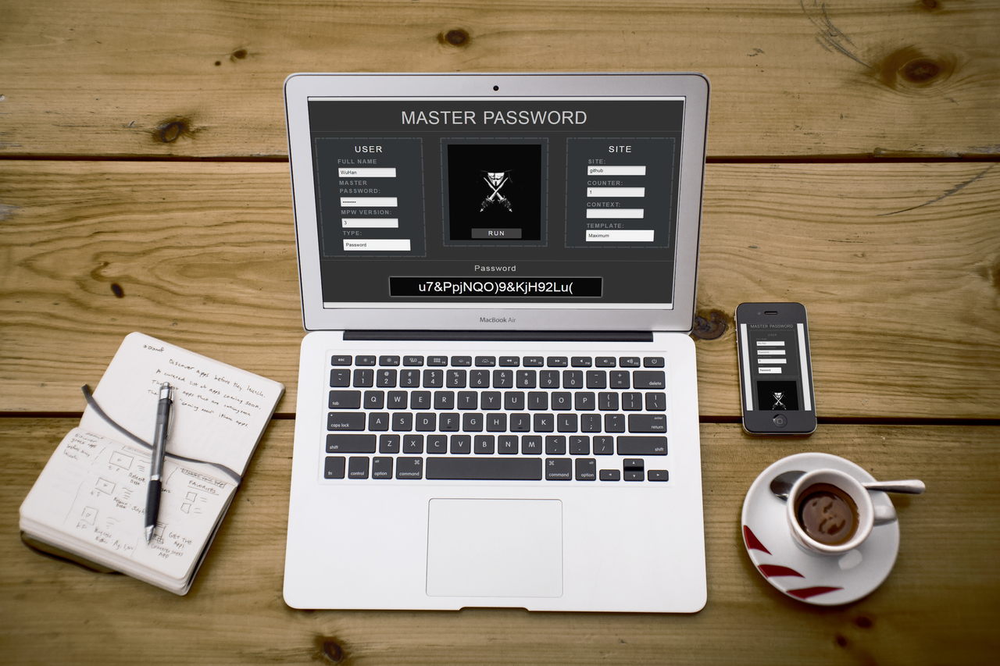
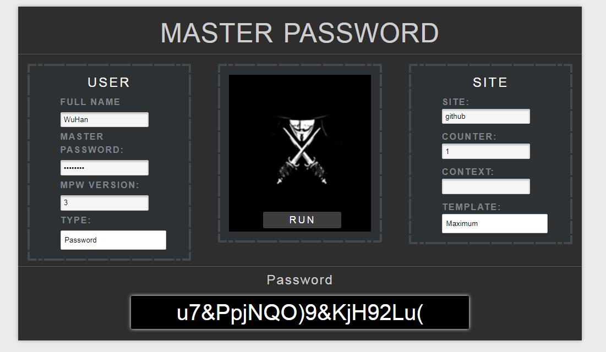
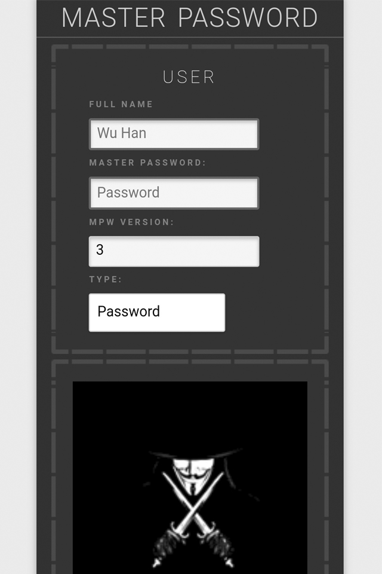
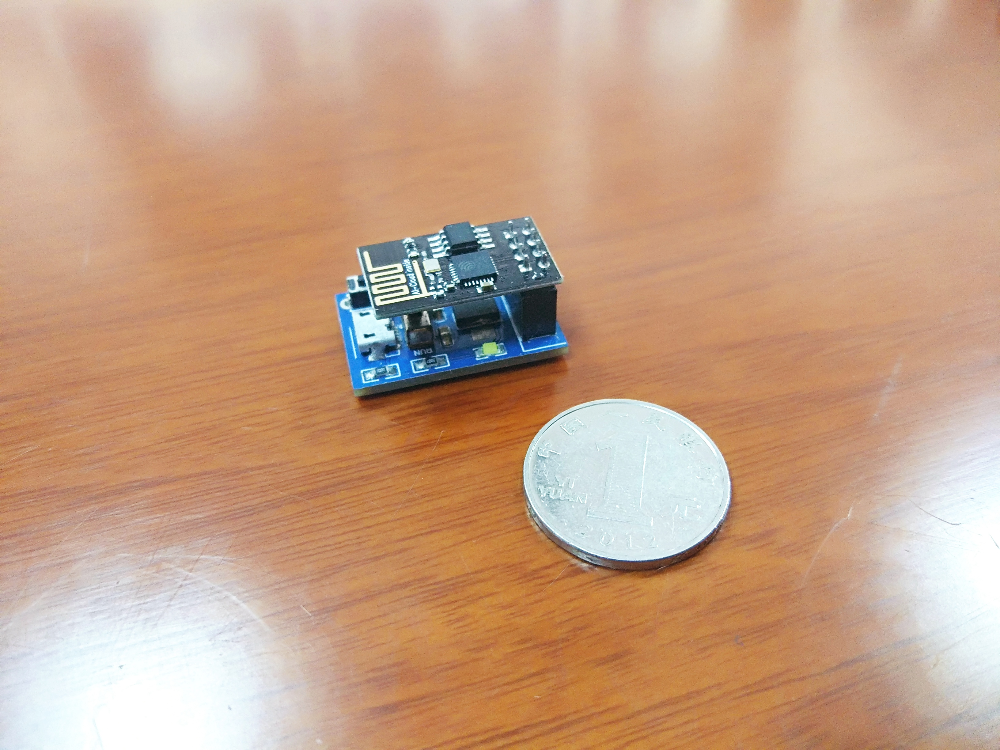
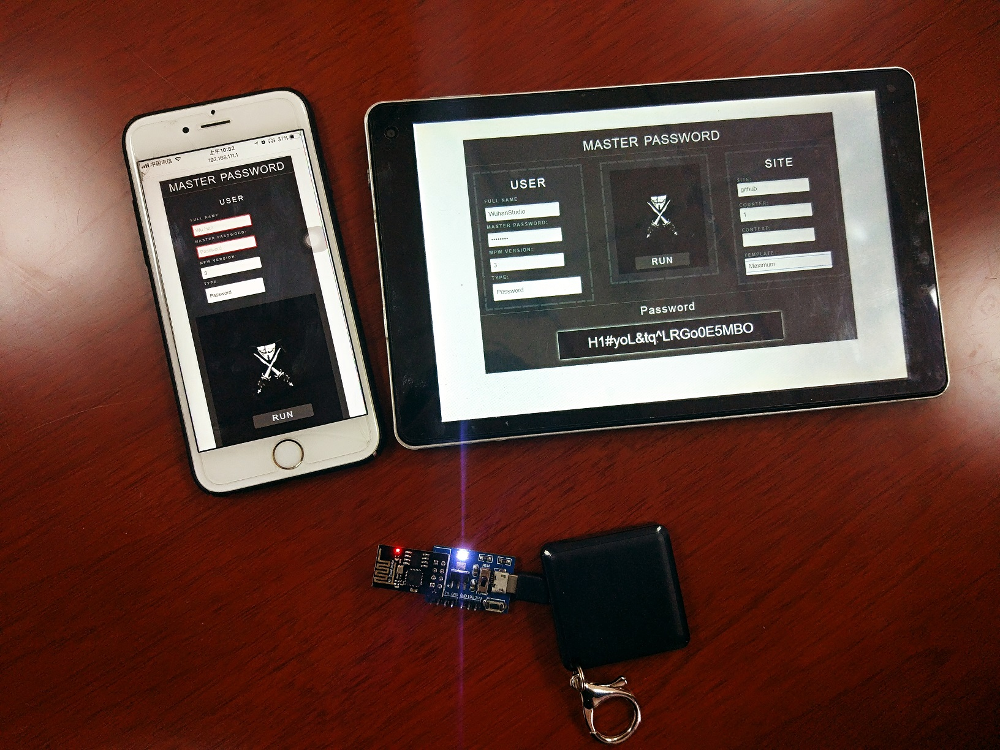
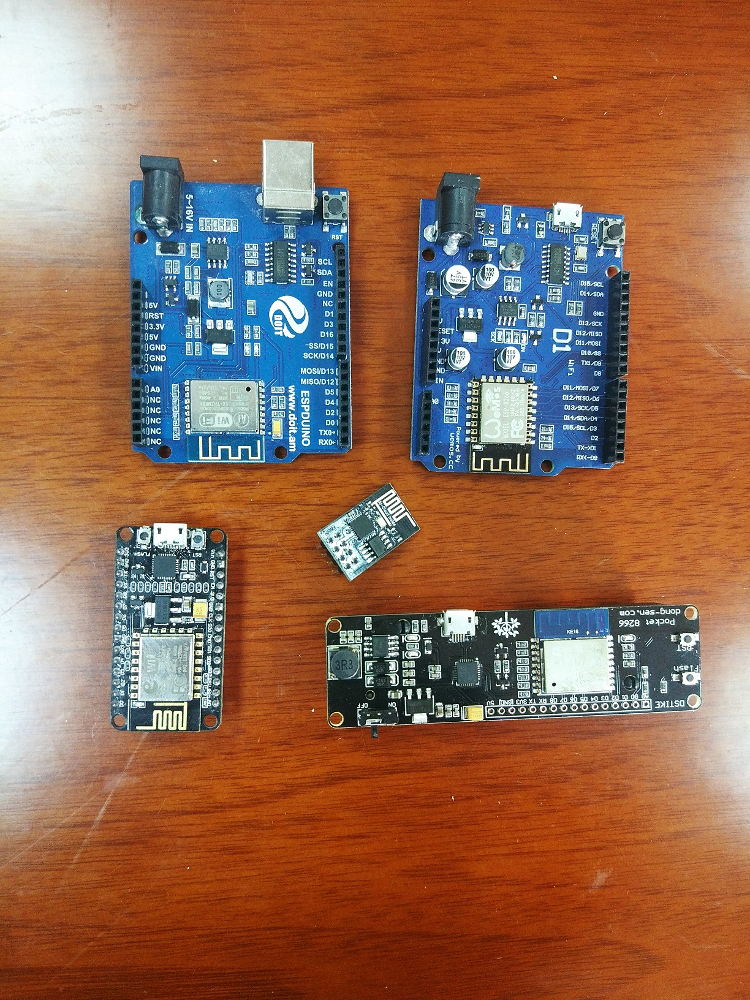

# MasterPassword on NodeMCU

<!--  -->

<!--  -->

<!--  -->

## What's this?

Always want to find a password manager, yet still considering security problems? Thanks to <a href="http://masterpasswordapp.com/">Master Password</a>, now here comes a solution.

Your passwords are generated instantly and will **never** be stored anywhere.

> No Storage - Nothing To Intercept - Nothing to Lose

This project makes it possible to take it with you everywhere like this : 

Wow, a pretty cute tiny password manager. It generates a wireless network which you can connect  with :

        SSID: masterpassword
        PSK : masterpassword

Then open your favorite browser and navigate to :

        http://192.168.111.1

Here it is :

Now you can generate your passwords instantly. Of course, nothing is gonna to be stored in it thus nothing to lose even if someone else got this module. 

## How it works

Actually I just fit <a href="https://github.com/tmthrgd/mpw-js.git"> mpw-js</a> into esp8266 with 50K RAM and 1MB flash storage. I'm using <a href="http://www.nodemcu.com/index_en.html">nodemcu</a> to run a tiny <a href="https://github.com/marcoskirsch/nodemcu-httpserver.git">http server</a> written in lua script language. You can find more useful resources at the bottom.

 

## Prerequisites

You can just use your favorite esp8266 module. As for now, I've tested all of these modules.

Then clone the source code and have fun. 

    git clone https://github.com/wuhanstudio/masterpassword-nodemcu.git
    
    git submodule init && git submodule update 

Oh, Remember you need **Python**. 

## How to install

0. Check out your serial port and modify **Makefile**

    For Linux :
        
        PORT=/dev/ttyUSB0

    For Windows :

        PORT=COM5

1. Erase your flash

    Though this is not necessary but recommended.

        make clean

2. Copy files

    This will get all configuration files ready.

        make install

3. Upload Firmware

        make upload_firmware

4. Upload Server and HTML files

        make upload_all 

5. Done, now connect to it and open your favorite browser

        SSID: masterpassword       PSK : masterpassword

        http://192.168.111.1

## Related Projects

Master Password :

> https://github.com/Lyndir/MasterPassword

MPW JS :

> https://github.com/tmthrgd/mpw-js

Nodemcu Firmware :

> https://github.com/nodemcu/nodemcu-firmware

Nodemcu Uploader :

> https://github.com/kmpm/nodemcu-uploader

Nodemcu Http Server :

> https://github.com/marcoskirsch/nodemcu-httpserver

> 